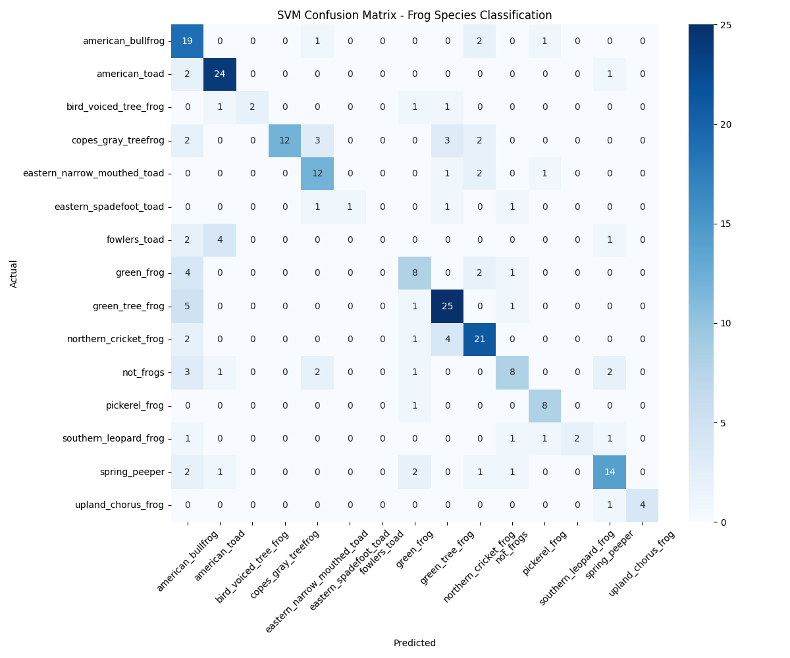

# SVM Model Results - Georgia Frog Classification

## 🎯 Performance Summary
- **Accuracy**: 67.5%
- **Validation Samples**: 237
- **Species Classes**: 15
- **Model**: SVM with RBF kernel

## 📊 Top Performing Species
| Species | F1 Score |
|---------|----------|
| upland_chorus_frog | 88.9% |
| american_toad | 82.8% |
| pickerel_frog | 80.0% |
| green_tree_frog | 74.6% |
| northern_cricket_frog | 72.4% |

## ⚠️ Areas Needing Improvement
- fowlers_toad: 0% F1
- eastern_spadefoot_toad: 40% F1  
- southern_leopard_frog: 50% F1

## 📈 Visualization

## 🚀 Next Steps
- Try class weighting for imbalanced data
- Experiment with different SVM kernels
- Hyperparameter tuning
- Compare with neural network approaches

## 🔧 Code Files
- `svm_model.py` - Main training script
- `check_results.py` - Results analysis
- `confusion_matrix.png` - Performance visualization